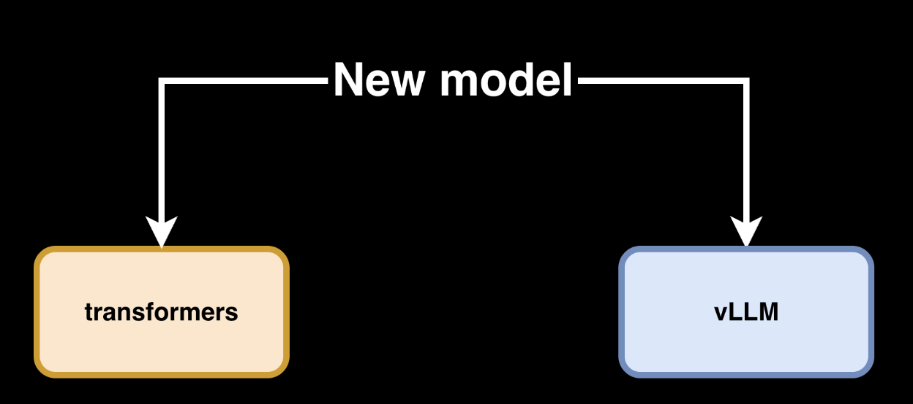
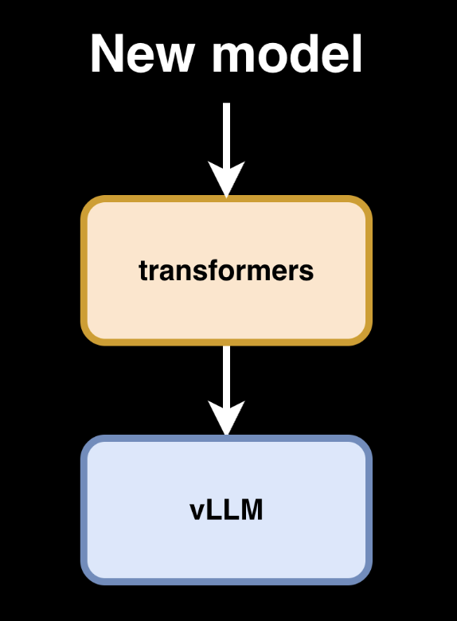

## Transformers modeling backend integration in vLLM

A recent addition to the vLLM codebase enables leveraging Transformers as a backend for model implementations. vLLM will therefore optimize throughput/latency on top of existing Transformers architectures.

A new model used to be integrated once for transformers, and once for vLLM with custom optimizations.

> When model authors wanted the absolute best performance, they were still writing custom vLLM implementations.

A new model once integrated to transformers, can now be immediately used in vLLM with native vLLM implementation speed

The latest iteration of the transformers modeling backend for vLLM dynamically applies inference specific layer fusions at runtime to match the speed of custom code implementations, for compatible architectures.

### How does it work?

The transformers modeling backend for vLLM now uses `torch.fx` to perform static analysis on the model’s graph. This process searches for known patterns that can be optimized. After any patterns have been identified, it uses ast (abstract syntax tree) to manipulate the source code and rewrite some of the operations in place.

- Fused operations that are many-to-one mapped to (ultra) optimized vLLM kernels, such as the ones used for Expert Parallelization (EP) in Mixture-of-Experts (MoE) models.
- The main other fused operations are vLLM's `MergedColumnParallelLinear` and `QKVParallelLinear`. These blocks allow us to infer parallel plans for TP (tensor-parallel). PP (pipeline-parallel) plans can also be inferred if the decoder block list is easily identifiable.
- The manipulated models are still fully (torch) compilable, being passed through torch.compile and CUDA Graphs, just the same as a dedicated vLLM model implementation.
- Unlike vLLM model implementations, Transformers model implementations can be used in training. So you can use the same model code for training/evals/RL rollouts.

### Transformers v5 standardizes model definitions

Transformers v5 is no longer intended merely to provide a convenient Python library for using models, but to become the de facto standard for model architectures across the open-source ecosystem.

Key changes include:

- Cleaner, self-contained model files that are easier to analyze statically.
- Modular Model Definitions that eliminate large amounts of duplicated architecture code.
- A unified `AttentionInterface` for integrating implementations such as SDPA, FlashAttention, and FlexAttention.
- More consistent interfaces for KV caching, attention, quantization, and weight loading.
- Transformers models designed for direct consumption by downstream engines such as vLLM, SGLang, llama.cpp, and MLX.

This is critical: only when different models expose recognizable, standardized structures can vLLM automatically identify Q/K/V projections, MoE expert layers, and decoder layer lists, and then replace them with its own high-performance implementations.
